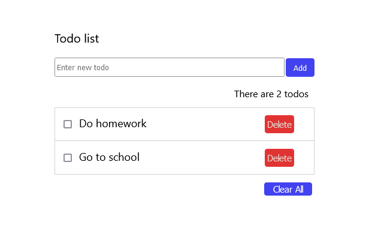

# React TodoList

This is a basic todo list application written using React.js.

### How to run it

```
create-react-app todolist
```
Replace the public and src folders with those in this repo.
```
npm start
```


